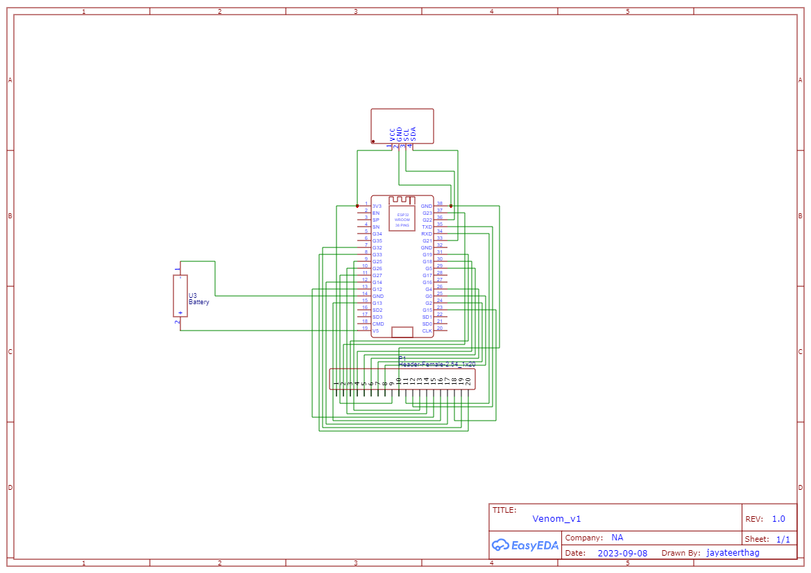
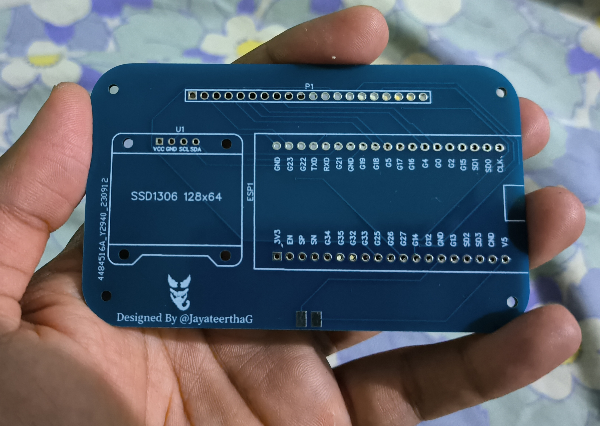

<h1><b>VENOM</b></h1>

> Venom - Your Portable Wireless & Hardware Hacking Companion

## Introduction

Welcome to Venom, your all-in-one portable wireless & hardware hacking device. Venom is designed to empower you with a wide range of capabilities for working with wireless & hardware penetration testing.

## Features

Venom comes equipped with a diverse set of features:

- [x] RF Signal Detection: Identify and detect RF signals in your vicinity.
- [x] Signal Recording: Capture and record RAW RF signals for later analysis. (Flipper Zero Compatible Format)
- [x] RF Signal Transmission: Transmit RAW RF signals to interact with compatible devices. (Flipper Zero Compatible Format)
- [x] RF Signal Jamming: Disable RF communication by jamming signals within specified frequencies.
- [x] RFID Reading: Read MIFARE RFID tags and access their data.
- [x] RFID Cloning/Writing: Clone or write data into RFID tags.
- [x] WiFi Deauthentication Attack: Perform WiFi deauthentication attacks on wireless networks.
- [ ] Rubber Ducky Attack: Execute automated keyboard-based attacks using the Rubber Ducky scripting language.
- [ ] IR Signal Recording: Capture and record IR signals for later analysis.
- [ ] IR Signal Transmission: Transmit IR signals to interact with compatible devices.

## Usage

* Get the required hardware
    * Venom PCB (Print the PCB using the [Gerber Files](./res/Gerber_PCB_Venom_v1.zip))
    * [ESP 32 (38 Pin)](https://www.amazon.in/ESP-32S-Development-Bluetooth-Ultra-Low-Consumption/dp/B07P6JBRSP?th=1)
    * [CC1101](https://www.ebay.com/itm/374591955761?mkevt=1&mkpid=0&emsid=e11050.m43.l1123&mkcid=7&ch=osgood&euid=7d9c602d2b934d20aa2094d9f367e922&bu=44768769130&osub=-1%7E1&crd=20230726225259&segname=11050)
    * [RC522 RFID Card Reader Module 13.56MHz](https://www.amazon.in/ApTechDeals-RFID-Kit-Arduino-Raspberry/dp/B07Q1B6QZR/ref=sr_1_1?crid=22FLJ2C6VC99O&keywords=rc522&qid=1695980451&s=industrial&sprefix=rc522+pins%2Cindustrial%2C352&sr=1-1)
    * [0.96" inch 128x64 IIC OLED Display - White - SSD1306 Driver](https://www.amazon.in/0-96-inch-128x64-OLED-Display/dp/B0C1XD9T5J/ref=sr_1_1?crid=1JWECW1WFZF0U&keywords=oled+ssd1306&qid=1695981107&sprefix=oled+ssd130%2Caps%2C345&sr=8-1)
    * Female Headers (40 Pins x 2, 20 Pins x 1)
    * Jumper Wires
    * Bolts & Nuts
* Compile & Upload Venom firmware into ESP 32 (38 pin) using PlatformIO
* Solder the components into the PCB
* Power On Venom using either 5V battery module or simply using a compatible powerbank & micro usb cable
* Connect to VENOM WiFi Hotspot through your mobile/desktop (password: 12345678)
* Open [Venom Web Console](./web/index.html) locally after downloading the web directory of this repository in your mobile/desktop to control Venom wirelessly ([Demo Website](https://venom.jayateerthag.in))

## Schematics

[OSHWLAB Project Link](https://oshwlab.com/jayateertha043/venom_v1)
 
 
</img>

## Demo

**YouTube Video (Zero PCB Version)**
 

 
PCB Reference Image Without any components soldered
 
</img>
  
PCB Reference Image With Female Headers soldered & main components(ESP 32 & OLed Display) inserted into the female headers.
 
</img>
  
PCB Reference Image With Female Headers soldered & components inserted into the female headers.
 
</img>
 

## Contributing

We welcome contributions from the community to enhance Venom's capabilities and usability.
Raise a pull request with proper comments of what has changed, for quickly merging into the main branch.

## License
Venom is distributed under the [MIT License](./LICENSE.md). Feel free to use, modify, and distribute it in accordance with the terms outlined in the license.

## Credits
* @joelsernamoreno - Part of code has been borrowed & customized from EvilCrow-RF

## Author

👤 **Jayateertha G**

* Twitter: [@jayateerthaG](https://twitter.com/jayateerthaG)
* Github: [@jayateertha043](https://github.com/jayateertha043)

## Show your support
 
Give a ⭐️ if this project helped you!